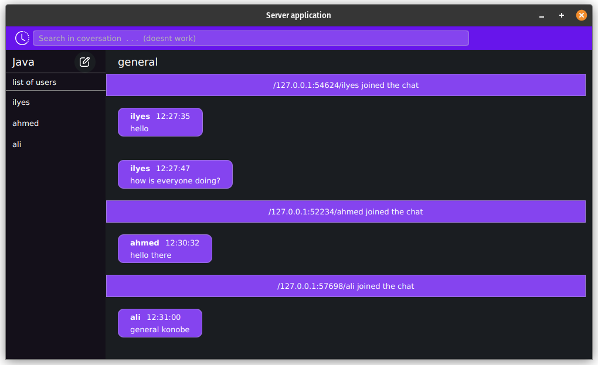
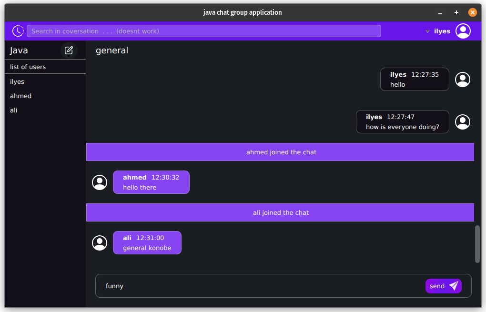
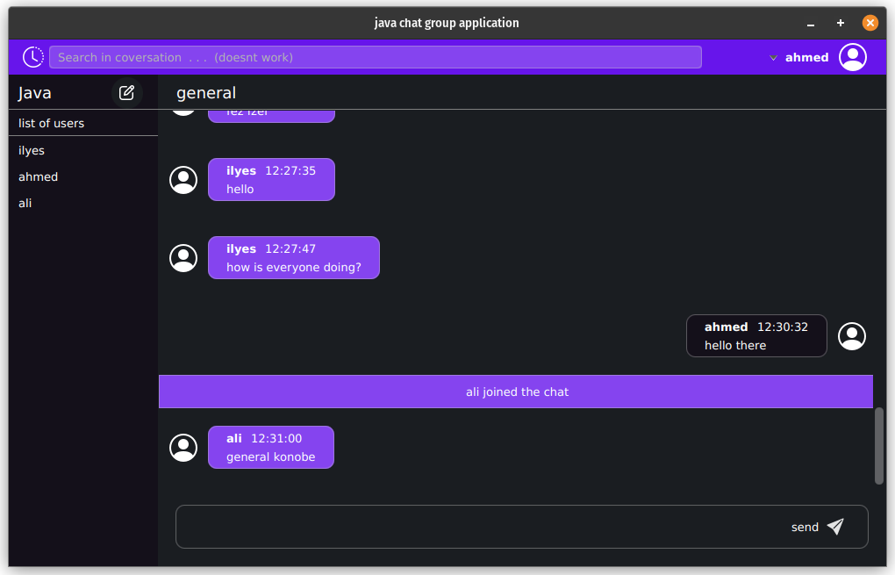

# Java multi-client chat application
built with javaFX with Maven as build tool with MySql database

## Features
- login and registration
- instant messaging
- messages saved in database
- see all active members in the chat and thier logout
- logout

## Scrreenshots
### server ui

### client ui



## Running
start mysql database and run the sql file in database DIR

to run first run server with this command in the server DIR
```
mvn clean javafx:run
```
to start clients run the same command in the client DIR